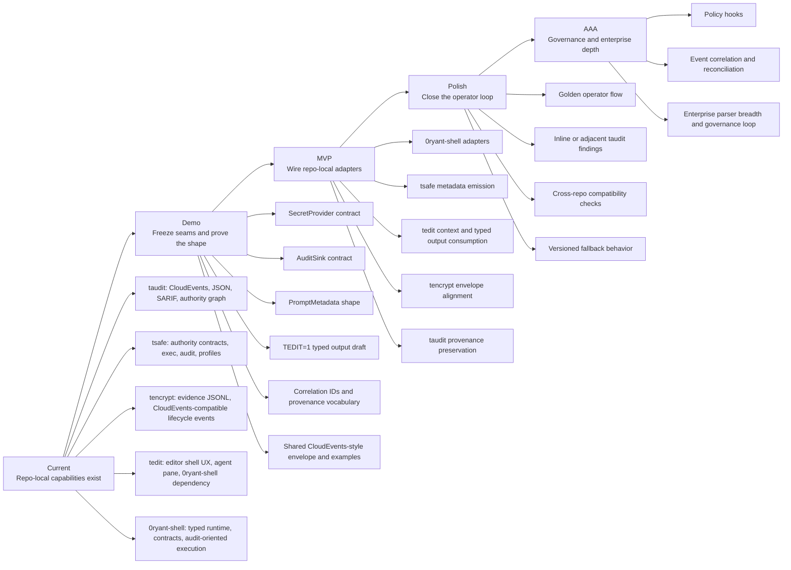
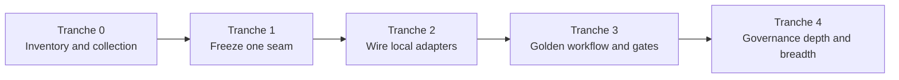

# Ecosystem Stage Board

_Council-authored on 2026-04-19 for taudit, tsafe, tencrypt, tedit, and 0ryant-shell._

## Council position

The council converged on a simple rule: standardize the seams, keep the runtimes local, and do not claim maturity ahead of verified cross-repo behavior.

## Ecosystem progress

Current stage: path to `Demo`
Current tranche: `Tranche 1 - seam freeze`

Overall progress: `[####----------------] 20%`

Tranche progress: `[##--------] 1 / 4 active`

Stage progress:

- `Current` - capability inventory exists across repos
- `Demo` - in progress: seam inventory exists, sibling notes are placed, and confirmed repo-local tasks are now folded back into this board
- `MVP` - not started
- `Polish` - not started
- `AAA` - not started

## Path chart

## Repo x stage view

| Repo | Current | Demo | MVP | Polish | AAA |
|---|---|---|---|---|---|
| `taudit` | done | active | queued | queued | queued |
| `tsafe` | done | active | queued | queued | queued |
| `tencrypt` | done | active | queued | queued | queued |
| `tedit` | done | active | queued | queued | queued |
| `0ryant-shell` | done | active | queued | queued | queued |

## Tranche model

Tranches are execution bundles inside the stage model. Stages describe maturity. Tranches describe what the next few loops should actually deliver.

| Tranche | Goal | Maps to stage | Status |
|---|---|---|---|
| `Tranche 0` | Inventory the seams, place repo notes, collect real sibling tasks | `Current -> Demo` | done |
| `Tranche 1` | Freeze one shared seam with examples, vocabulary, and validation | `Demo` | active |
| `Tranche 2` | Wire repo-local adapters against the frozen seam | `MVP` | queued |
| `Tranche 3` | Close the operator loop with one golden workflow and cross-repo gates | `Polish` | queued |
| `Tranche 4` | Add governance depth, enterprise breadth, and long-tail hardening | `AAA` | queued |

## Tranche chart

## Critical path

These jobs unblock more than one repo and should be treated as the shared path to `Demo`:

1. Freeze one versioned CloudEvents-style evidence envelope with stable correlation and provenance fields.
2. Freeze `SecretProvider`, `AuditSink`, `PromptMetadata`, and `TEDIT=1` minimum contract shapes.
3. Publish golden examples and validation fixtures in each repo.
4. Prove one visible operator workflow across editor, shell, authority, and evidence surfaces.
5. Collect repo-local tasks from sibling repos and fold them back into this board.

In tranche terms, the immediate critical path is narrower:

1. pick one seam
2. freeze its vocabulary and examples
3. validate it locally and in CI where possible
4. only then wire adapters

## Stage definitions

### Demo

The seam is explicit, versioned, example-backed, and legible in one sitting.

Exit bar:

- shared seam documents exist
- golden examples exist in each repo
- contract validation exists in CI or local gates
- one end-to-end demonstration path is named and understood

### MVP

Each repo has its own adapter for the shared seam. No shared runtime is introduced.

Exit bar:

- 0ryant-shell adapters are wired
- tsafe metadata and evidence are emitted in the agreed shape
- tedit consumes prompt metadata and typed shell output
- tencrypt aligns evidence to the shared envelope
- taudit preserves provenance consistently in findings and evidence output

### Polish

An operator can run the golden workflow, see active context, inspect correlated evidence, and understand the result without digging through implementation notes.

Exit bar:

- one golden operator workflow is documented and runnable
- taudit findings surface inline or adjacent to that flow
- fallback behavior and version mismatches are handled explicitly
- cross-repo compatibility checks stay green

### AAA

The governance loop is closed across repos with production-grade automation, breadth, and operational confidence.

Exit bar:

- governance correlation schema is consistent across repos
- taudit supports deeper identity/rule/platform coverage
- policy hooks and reconciliation exist where needed
- cross-repo release and compatibility discipline is durable

## Tranche breakdown

### Tranche 1 - seam freeze

The point of this tranche is not to solve the ecosystem. It is to freeze one seam tightly enough that downstream repos can stop guessing.

Candidate seams:

1. shared CloudEvents-style envelope and correlation vocabulary
2. `SecretProvider` contract between `tsafe` and `0ryant-shell`
3. taudit findings refresh/export contract for `tedit`

Definition of done:

- one seam is chosen explicitly
- field names and semantics are written down
- at least one golden example exists
- validation path is named
- downstream adapter work can reference the seam without re-debating it

### Tranche 2 - repo-local adapters

The point of this tranche is to wire only the adapters required for the chosen seam. No new shared runtime and no attempt to solve every adjacent protocol.

Definition of done:

- repo-local adapters compile or validate against the frozen seam
- one integration path works end to end for that seam
- known fallback behavior is documented

### Tranche 3 - operator loop

The point of this tranche is to make the integration real for an operator rather than merely schema-correct.

Definition of done:

- one golden workflow is runnable
- taudit, tsafe, 0ryant-shell, and at least one consumer surface participate coherently
- cross-repo smoke or compatibility gates exist

### Tranche 4 - governance depth

The point of this tranche is breadth, enterprise hardening, and durable evolution after the operator path works.

Definition of done:

- governance correlation is stable
- advanced parser/rule/platform work proceeds without breaking the frozen seams
- release and compatibility discipline are durable across repos

## All known jobs

### Path to Demo

| Job | Owners | Notes |
|---|---|---|
| Freeze shared CloudEvents-style evidence envelope | `taudit`, `tencrypt`, `tsafe`, `0ryant-shell` | Required fields: `id`, `source`, `subject`, `time`, correlation, provenance, repo-local payload |
| Freeze `PromptMetadata` shape | `tsafe`, `tedit`, `taudit` | Minimum fields: profile, contract, namespace, trust mode |
| Reconcile `SecretProvider` contract with actual tsafe semantics | `0ryant-shell`, `tsafe` | Do not let adapter behavior drift from provider truth |
| Freeze `AuditSink` contract | `0ryant-shell`, `taudit` | Support taudit-friendly graph, JSON, and CloudEvents handoff |
| Draft minimal `TEDIT=1` typed output protocol | `tedit`, `0ryant-shell` | Include typed records and source-span links |
| Freeze correlation IDs and provenance vocabulary | all repos | Needed before governance claims |
| Publish golden seam examples and fixtures | all repos | Versioned, example-backed, CI-validated |
| Add contract round-trip tests for `tsafe <-> 0ryant-shell` | `tsafe`, `0ryant-shell` | Demo gate item |
| Add contract round-trip tests for `taudit <-> 0ryant-shell` | `taudit`, `0ryant-shell` | Demo gate item |
| Write sibling repo notes and collect repo-local tasks | all repos | Done for the initial note placement; follow-on collection now reflected below |

### Path to MVP

| Job | Owners | Notes |
|---|---|---|
| Implement `0ryant-shell` `SecretProvider` via tsafe | `0ryant-shell`, `tsafe` | Avoid ad hoc subprocess substitution |
| Implement `0ryant-shell` `AuditSink` via taudit-friendly emission | `0ryant-shell`, `taudit` | Semantic, auditable, correlation-aware events |
| Emit prompt metadata and secret lifecycle evidence at execution boundaries | `tsafe` | Shared envelope, stable provenance |
| Consume `PromptMetadata` in editor surfaces | `tedit` | Show ambient authority context |
| Consume `TEDIT=1` typed output from shell boundary | `tedit`, `0ryant-shell` | Maintain graceful fallback |
| Align tencrypt evidence to shared envelope | `tencrypt` | Include correlation and provenance continuity |
| Preserve shell and tool provenance in taudit findings and evidence | `taudit` | Needed for joined operator stories |
| Add cross-repo compatibility tests in CI | all repos | Not just per-repo validation |
| Add multi-binary smoke harness | all repos | `tsafe`, `taudit`, `0ryant-shell`, `tedit`, `tencrypt` |
| Ship taudit `cargo install` story, GitHub Action, and PR comment bot | `taudit` | Makes taudit easier to adopt in real review flow |

### Path to Polish

| Job | Owners | Notes |
|---|---|---|
| Ship one golden operator workflow | `tedit`, `0ryant-shell`, `tsafe`, `tencrypt`, `taudit` | Author or inspect, execute, correlate, inspect findings |
| Show active tsafe authority context inside shell and editor | `tsafe`, `tedit`, `0ryant-shell` | Operator-facing clarity gate |
| Surface taudit findings inline or adjacent to the golden flow | `taudit`, `tedit` | Stable drill-through identifiers |
| Add version checks and graceful fallback for binary mismatches | `tedit`, `0ryant-shell` | Reduce integration fragility |
| Replace stale `.refs`-only assumptions with version-pinned live checks where feasible | `taudit` | Avoid false confidence from snapshots |
| Parse composite GitHub Actions correctly | `taudit` | Precision work |
| Add expression evaluation that affects completeness | `taudit` | Precision work |
| Add `EgressBlindspot` and `MissingAuditTrail` | `taudit` | Depends on richer parser metadata |
| Tighten dependency-hygiene parity across repos | all repos | `tedit` supply-chain parity is specifically called out |

### Path to AAA

| Job | Owners | Notes |
|---|---|---|
| Add Azure DevOps parser and environment approval boundaries | `taudit` | Enterprise breadth |
| Deepen OIDC, service principal, and cloud identity modelling | `taudit`, `tsafe` | Biggest long-term risk surface |
| Complete all taudit finding categories | `taudit` | Includes confidence depth and custom rules |
| Add custom rule loading and policy-as-code | `taudit` | Enterprise adoption lever |
| Add explicit isolation boundaries, subgraph extraction, DOT export, adjacency index | `taudit` | Graph power and scale |
| Close governance loop across findings, remediation intent, and execution evidence | all repos | Durable correlation story |
| Add policy-enforcement hooks where signals justify them | `tsafe`, `taudit`, `0ryant-shell` | Avoid premature coupling |
| Add replay and reconciliation discipline for event evolution | all repos | Needed before heavy automation |
| Add signed releases, fuzzing, property tests, and propagation benchmarks where missing | all repos | Operational trust bar |

## Repo asks and expectations

### `tsafe`

- taudit may need: frozen `PromptMetadata`, stable `SecretProvider` semantics, authority context at execution boundaries, and correlation/provenance fields in lifecycle evidence.
- taudit expects: versioned examples, compatibility tests, and recommendation-validation hooks once the seam is frozen.

### `tencrypt`

- taudit may need: evidence aligned to the shared envelope, stable correlation IDs, provenance continuity, and one auditable workload in the golden flow.
- taudit expects: CI validation against the shared envelope and practical `tsafe exec` wrapping where it materially improves auditability.

### `tedit`

- taudit may need: consumer requirements for `PromptMetadata`, typed output expectations, and the first surface for findings summaries adjacent to operator work.
- taudit expects: graceful degradation for missing `0ryant-shell`, richer typed-output surfaces later, and drill-through into findings over time.

### `0ryant-shell`

- taudit may need: frozen `SecretProvider` and `AuditSink` ports, correlation propagation, schema reconciliation with tsafe, and round-trip tests against taudit export paths.
- taudit expects: stable repo-local adapters, taudit-friendly semantic events, and explicit binary/version contracts with `tedit`.

## Confirmed repo-local tasks collected this loop

These items come from existing sibling-repo roadmaps and tracking files, not just taudit-authored asks.

### `tsafe`

Source signals:

- `authority contracts` and `audit explanation` are the active priority lens in `tsafe`
- the first operator-facing explanation must answer what authority was given, why it was allowed, and what was denied or stripped

Confirmed tasks to fold into the shared plan:

| Stage | Task | Dependency or blocker |
|---|---|---|
| `Demo` | Freeze a machine-readable authority-context shape that can back `PromptMetadata` without weakening tsafe's contracts-first model | Must stay aligned with tsafe authority contracts rather than generic editor metadata |
| `Demo` | Define denial/explanation semantics clearly enough that sibling repos can distinguish allowed, denied, and stripped authority | Depends on tsafe's audit explanation lane |
| `MVP` | Emit authority-context and execution-boundary evidence in a shape siblings can consume reliably | Must preserve tsafe as the source of truth for scoped authority |
| `Polish` | Keep explanation quality high enough that editor and taudit surfaces do not over-simplify tsafe decisions | Blocked if integration tries to outrun tsafe's explanation model |

### `tencrypt`

Source signals:

- tencrypt already emits local audit JSONL and CloudEvents JSONL
- tencrypt exports evidence artifacts via CellOS export channels
- transport-grade NATS or JetStream remains deferred

Confirmed tasks to fold into the shared plan:

| Stage | Task | Dependency or blocker |
|---|---|---|
| `Demo` | Reuse tencrypt's existing evidence JSONL and CloudEvents outputs as one of the golden seam examples | Needs shared envelope vocabulary frozen first |
| `MVP` | Align tencrypt evidence fields to the shared envelope without breaking current CellOS export flow | Must keep repo-local run-to-completion CLI model intact |
| `MVP` | Propagate shared correlation and provenance fields through evidence artifacts | Depends on cross-repo correlation vocabulary |
| `AAA` | Evaluate whether deferred transport adapters are still needed after the envelope and export path are stable | Should not preempt seam discipline |

### `tedit`

Source signals:

- `tedit` already tracks explicit `Demo`, `MVP`, `Polish`, and `AAA` jobs
- agent context already includes tsafe env vars and latest taudit findings snapshot
- major planned asks already name `0ryant-shell`, `tsafe`, and `taudit`

Confirmed tasks to fold into the shared plan:

| Stage | Task | Dependency or blocker |
|---|---|---|
| `Demo` | Create one repeatable demo script against a stable sample repo | Needs one agreed reference repo and happy-path flow |
| `Demo` | Capture one deterministic demo artifact | Needs stable commands and expected screens |
| `MVP` | Replace stringly terminal integration with an explicit 0sh host contract | Blocked on documented hosted-session contract from `0ryant-shell` |
| `MVP` | Render typed 0sh output natively instead of raw terminal text | Blocked on `TEDIT=1` structured output protocol |
| `MVP` | Make source-span errors clickable end to end | Blocked on span emission format or side-channel from `0ryant-shell` |
| `MVP` | Make tsafe context authoritative in the terminal header | Blocked on a machine-readable active-context contract from `tsafe` |
| `MVP` | Make taudit findings reliably available to the agent | Blocked on stable taudit export format and refresh semantics |
| `Polish` | Run performance-budget, persistence, and terminal UX hardening after the integration contracts settle | Sequenced after sibling contract stability |

### `0ryant-shell`

Source signals:

- the council roadmap in `0ryant-shell` already defines Wave 1 foundations, Wave 2 authority spine, and Wave 3 surface and hardening
- immediate tasks include contract validation in CI, secret-provider protocol stability, taudit ingest parity, and shared error/event envelopes

Confirmed tasks to fold into the shared plan:

| Stage | Task | Dependency or blocker |
|---|---|---|
| `Demo` | Standardize CloudEvents envelope usage and error-envelope semantics in CI | Must land before heavy runtime integration |
| `Demo` | Stabilize secret-provider adapter contract conformance between 0sh and tsafe | Shared seam blocker |
| `Demo` | Ensure contract validation is required in CI and saves report artifacts | Needed for cross-repo proof discipline |
| `MVP` | Stabilize taudit export ingestion path from 0sh artifacts and events | Depends on taudit-compatible sink contract |
| `MVP` | Add end-to-end authority-loop checks as release gates | Depends on shared fixture vocabulary and correlation IDs |
| `Polish` | Harden tedit and cellshell-lsp bridge behavior around typed output and diagnostics | Depends on Wave 2 stability |
| `Polish` | Define tencrypt handoff and attestation integration with 0sh execution boundaries | Sequenced after authority-spine work |

## Newly confirmed blockers

1. `tedit` cannot close its MVP loop until `0ryant-shell` publishes a hosted-session contract and `TEDIT=1` typed output shape.
2. `taudit` cannot make editor refresh deterministic until its export format and refresh semantics are treated as a stable consumer contract, not just a sink implementation detail.
3. `tsafe` integration must stay subordinate to authority contracts and audit explanation; generic metadata plumbing cannot outrun its trust model.
4. `tencrypt` already has useful evidence outputs, but envelope alignment must not break its run-to-completion CLI and CellOS export model.
5. Cross-repo CI and fixture validation are now explicit shared work, not optional polish.

## Tranche 1 recommendation

Start with the shared CloudEvents-style envelope and correlation vocabulary.

Why this seam first:

- `taudit`, `tencrypt`, and `0ryant-shell` already have evidence or event surfaces
- `tedit` can consume the result later without blocking the first freeze
- it creates a reusable foundation for both `AuditSink` and findings refresh work
- it avoids forcing tsafe's authority model into a premature editor-facing abstraction

Tranche 1 sub-jobs:

1. define the minimum shared envelope fields and extension vocabulary
2. map current taudit and tencrypt outputs to that vocabulary
3. identify where 0ryant-shell must conform or emit adapters
4. record what remains repo-local payload, not shared contract
5. add one golden example per participating repo

Draft artifact produced in this loop:

- `contracts/schemas/ecosystem-evidence-envelope-v0.schema.json`
- `contracts/examples/ecosystem-evidence-envelope.example.json`
- `Plans/tranche-1-shared-envelope-draft.md`

## Next loop

The next loop should execute `Tranche 1` rather than revisit the full roadmap. Concretely:

1. freeze the shared CloudEvents-style envelope and correlation vocabulary
2. produce a taudit-side contract draft and examples
3. note the exact delta each sibling repo would need to conform