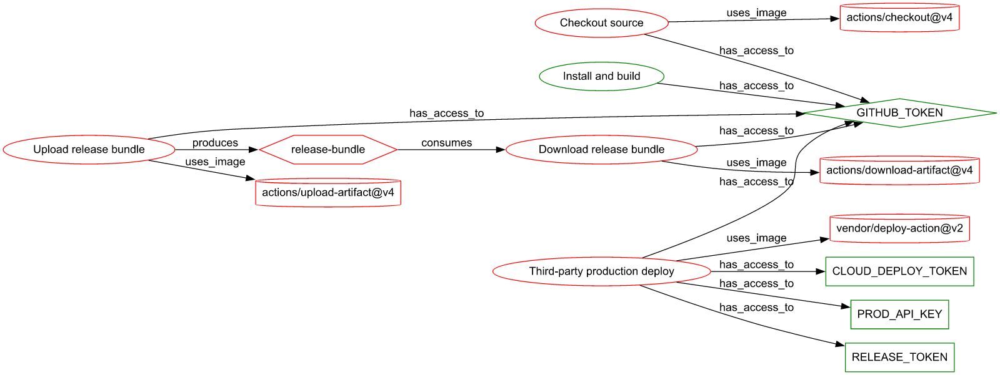
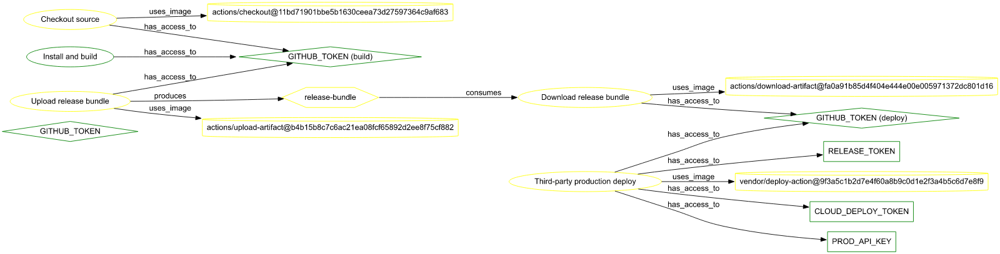
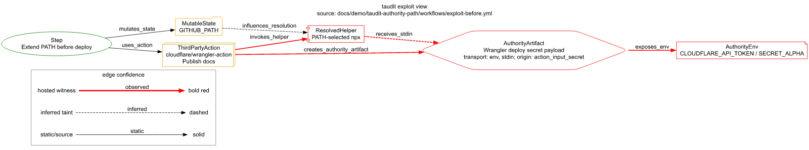

# taudit — Workflow Authority Review (authority-path demo)

A complete, reproducible evidence pack for two synthetic CI workflows. It shows
the loop taudit runs on a pipeline:

> **hidden authority → visible authority → reduced authority → baselined authority → reusable evidence**

Everything in this directory was produced by `taudit 1.3.0-pre` from the
workflow files in [`workflows/`](workflows). No outputs are hand-edited. Both
targets are **fully synthetic** — `vendor/deploy-action` does not exist; the
Cloudflare action is real and public but its account/token names are
placeholders; secret names (`PROD_API_KEY`, `RELEASE_TOKEN`,
`CLOUD_DEPLOY_TOKEN`, `CLOUDFLARE_*`) are placeholders. Nothing here references
any real organisation, repository, or credential.

Two complementary scenarios:

- **Scenario A — authority propagation** (`before.yml` / `after.yml`): a
  third-party deploy action quietly inherits broad authority. Best seen in the
  **authority** graph view.
- **Scenario B — exploit path** (`exploit-before.yml` / `exploit-after.yml`): a
  concrete multi-hop kill-chain via PATH poisoning. Best seen in the **exploit**
  graph view.

---

## TL;DR

| | Scenario A before → after | Scenario B before → after |
|---|---|---|
| Total findings | **22 → 8** | **21 → 3** |
| Critical | **11 → 2** (structural floor) | **8 → 0** |
| Exploitable chain (`untrusted_with_authority`) | **7 → 0** | **4 → 0** |
| `taudit graph --view exploit` paths | n/a (authority-view risk) | **1 → 0** |
| Unpinned actions | **4 → 0** | **3 → 0** |

In both, the exploitable chain is removed. Scenario A's residual is the
structural `GITHUB_TOKEN` floor (which we **baseline**); Scenario B goes to
zero critical and zero exploit paths.

---

# Scenario A — authority propagation (developer-tool path)

## 1. What happened

`workflows/before.yml` is an ordinary-looking two-job pipeline: a `build` job
produces an artifact, a `deploy` job ships it to production through a
third-party action.

```yaml
permissions:
  contents: write
  packages: write
  id-token: write
# ...
      - name: Third-party production deploy
        uses: vendor/deploy-action@v2          # mutable tag — code can change under it
        with:
          release-token: ${{ secrets.RELEASE_TOKEN }}
          prod-api-key:  ${{ secrets.PROD_API_KEY }}
        env:
          CLOUD_DEPLOY_TOKEN: ${{ secrets.CLOUD_DEPLOY_TOKEN }}
```

Two things make this dangerous and **neither is visible by reading the YAML
top-to-bottom**:

1. **Authority is granted workflow-wide.** `contents/packages/id-token: write`
   applies to *every* job and step, including the third-party action.
2. **The executable is mutable.** `vendor/deploy-action@v2` is a moving tag.
   Whoever can move that tag inherits write authority over the repo and
   packages, an OIDC identity, and three production secrets — without ever
   touching this repository.

This is the same shape as the real-world "trusted tool quietly inherits more
authority than anyone intended" class of incident, reduced to a minimal
synthetic case.

## 2. What taudit found — *hidden authority made visible*

`taudit graph --view authority` renders the authority graph. Red nodes are
**untrusted** (mutable / third-party); the secrets and identity each step can
reach are explicit edges.



The "Third-party production deploy" step (red) has `has_access_to` edges to
**`CLOUD_DEPLOY_TOKEN`, `PROD_API_KEY`, `RELEASE_TOKEN`, and `GITHUB_TOKEN`**,
and `uses_image` → the unpinned `vendor/deploy-action@v2` (red). That is the
hidden authority movement, drawn.

`taudit scan` quantifies it — **22 findings, 11 critical** (full breakdown in
[`results/summary.md`](results/summary.md)). The exploitable core is the
**7 `untrusted_with_authority`** findings: untrusted steps with *direct* access
to the token and each secret.

## 3. What changed — *reduced authority*

`workflows/after.yml` applies the standard remediation — no new tooling, just
least authority:

- **Least privilege.** Default `permissions: contents: read`; each job opts in
  to only what it needs (the deploy job gets `id-token: write`, nothing else).
- **Immutable executables.** Every action is pinned to a full-length commit
  SHA, so a moved tag can no longer swap code under a trusted name.
- **Scoped secrets.** Deploy secrets come from the protected `production`
  environment and reach only the now-immutable deploy step.

The same `authority` view after remediation — the previously-red nodes are now
**yellow** (pinned / trusted), and `GITHUB_TOKEN` is split into scoped
`(build)` / `(deploy)` identities:



`taudit diff before.yml after.yml` ([`results/diff.txt`](results/diff.txt))
states the change precisely: **findings 22 → 8 (−14)**, with all 7
`untrusted_with_authority` criticals, all 4 unpinned-action findings, and the
workflow-wide write scope **removed**.

## 4. What remains — *honest residual*

The AFTER workflow is **not** zero-findings, by design:

- **2 critical** — `GITHUB_TOKEN` propagation. Actions injects this token into
  every job; its reach is structural. This is the floor, not a regression.
- **3 high** — the three secrets still reach a *third-party* action. It is now
  pinned and reviewed, so this is residual third-party trust, not an open
  exploit. Removing it means moving to OIDC or a first-party deploy path.
- **1 high** — `id-token: write` on deploy could be scoped tighter still.
- **1 low / 1 info** — `PROD_API_KEY` is a static credential (use OIDC), and an
  OIDC-without-attestation note.

## 5. Baselined authority — *the gate*

`taudit baseline init after.yml` records those 8 residual findings as the
**accepted floor** ([`.taudit/baselines/`](.taudit/baselines)). From then on:

```
$ taudit baseline diff after.yml
docs/demo/taudit-authority-path/workflows/after.yml: 0 NEW, 0 FIXED, 8 PRE-EXISTING
```

`0 NEW` is the point. A future pull request that re-broadens a permission or
unpins an action shows up as **NEW** authority movement and fails the gate —
while the known, accepted floor stays quiet. (Captured in
[`baseline/baseline-diff.txt`](baseline/baseline-diff.txt).)

# Scenario B — exploit path (PATH-helper hijack)

Scenario A is *authority propagation* — broad authority reaching an untrusted
sink. Scenario B is sharper: a concrete, multi-hop **exploit path** that
`taudit graph --view exploit` traces end to end.

`workflows/exploit-before.yml` extends `$GITHUB_PATH` with a writable directory
*before* a deploy action runs:

```yaml
      - name: Extend PATH before deploy
        run: echo "$HOME/.local/bin" >> $GITHUB_PATH

      - name: Publish docs
        uses: cloudflare/wrangler-action@v3      # resolves npx/wrangler via PATH
        with:
          accountId: ${{ secrets.CLOUDFLARE_ACCOUNT_ID }}
          apiToken:  ${{ secrets.CLOUDFLARE_PAGES_API_TOKEN }}
```

taudit traces the kill-chain: the PATH mutation poisons the helper the deploy
action resolves, and that helper runs while the Cloudflare deploy authority is
in scope:



> PATH mutation → PATH-selected helper → deploy action → authority artifact
> (deploy secret payload) → `CLOUDFLARE_API_TOKEN` / `SECRET_ALPHA` exposed.

`workflows/exploit-after.yml` removes the chain by **deleting the PATH mutation**
(so helper resolution can't be redirected), pinning every action to a SHA, and
dropping the unused `id-token: write`. The result
([`results/exploit-diff.txt`](results/exploit-diff.txt)):

| | exploit-before | exploit-after |
|---|---:|---:|
| Total findings | 21 | **3** |
| Critical | 8 | **0** |
| `--view exploit` paths | 1 | **0** |

The 3 residuals are high (Cloudflare secrets reaching the now-pinned
third-party action) and one medium (structural `GITHUB_TOKEN`) — no criticals,
no exploit path. Artifacts carry the `exploit-` prefix (workflows, findings,
graphs, map, receipts, diff).

---

## 6. Reusable evidence — *what's in this pack*

```
taudit-authority-path/
├── README.md                     ← this walkthrough
├── workflows/
│   ├── before.yml                ← synthetic vulnerable workflow
│   ├── after.yml                 ← Scenario A remediated (SHA-pinned, least-privilege)
│   ├── exploit-before.yml        ← Scenario B vulnerable (PATH poisoning)
│   └── exploit-after.yml         ← Scenario B remediated (PATH mutation removed, pinned)
├── findings/
│   ├── before.findings.json / before.sarif        ← Scenario A (22 findings)
│   ├── after.findings.json  / after.sarif         ← Scenario A (8 findings)
│   ├── exploit-before.findings.json / .sarif      ← Scenario B (21 findings)
│   └── exploit-after.findings.json  / .sarif      ← Scenario B (3 findings)
├── graph/
│   ├── before-authority.{png,svg,dot,mmd}         ← A: authority graph (headline)
│   ├── after-authority.{png,svg,dot,mmd}
│   ├── exploit-before-killchain.{png,svg,dot}     ← B: exploit-view kill-chain (headline)
│   ├── exploit-before-authority.{png,svg,dot,mmd} / exploit-after-authority.*
│   └── exploit-after-killchain.dot                ← empty (path_count 0 — proof of removal)
├── authority-matrix/
│   ├── before.map.txt / after.map.txt             ← A: which step reaches which secret/identity
│   └── exploit-before.map.txt / exploit-after.map.txt   ← B
├── baseline/
│   └── baseline-diff.txt         ← taudit baseline diff output (0 NEW)
├── .taudit/baselines/<hash>.json ← the committed baseline (accepted floor)
├── receipts/
│   ├── before-receipt.json / after-receipt.json                ← A scan receipts
│   └── exploit-before-receipt.json / exploit-after-receipt.json ← B scan receipts
├── results/
│   ├── diff.json / diff.txt          ← Scenario A taudit diff before→after
│   ├── exploit-diff.json / .txt      ← Scenario B taudit diff before→after
│   └── summary.md                    ← Scenario A findings table, by rule
└── tools/
    ├── render-dot.mjs             ← DOT → SVG (no system graphviz needed)
    └── svg2png.mjs                ← SVG → PNG
```

## 7. Reproduce it

Requires the `taudit` binary (`cargo build -p taudit --release` →
`target/release/taudit`) and Node 18+ for image rendering. From the repo root,
`taudit` below means that binary. See [`reproduce.ps1`](reproduce.ps1) for a
one-shot script.

```bash
P=docs/demo/taudit-authority-path

# Findings — JSON + SARIF, before and after
taudit scan  $P/workflows/before.yml --format json  -o $P/findings/before.findings.json
taudit scan  $P/workflows/before.yml --format sarif -o $P/findings/before.sarif
taudit scan  $P/workflows/after.yml  --format json  -o $P/findings/after.findings.json
taudit scan  $P/workflows/after.yml  --format sarif -o $P/findings/after.sarif

# Authority matrix (which step reaches which secret/identity)
taudit map   $P/workflows/before.yml --format text > $P/authority-matrix/before.map.txt
taudit map   $P/workflows/after.yml  --format text > $P/authority-matrix/after.map.txt

# Authority graph → DOT/Mermaid, then render to SVG + PNG
taudit graph $P/workflows/before.yml --view authority --format dot > $P/graph/before-authority.dot
taudit graph $P/workflows/after.yml  --view authority --format dot > $P/graph/after-authority.dot
(cd $P/tools && npm ci)
node $P/tools/render-dot.mjs $P/graph/before-authority.dot $P/graph/before-authority.svg
node $P/tools/svg2png.mjs   $P/graph/before-authority.svg $P/graph/before-authority.png

# Before → after diff
taudit diff  $P/workflows/before.yml $P/workflows/after.yml --format terminal > $P/results/diff.txt
taudit diff  $P/workflows/before.yml $P/workflows/after.yml --format json     > $P/results/diff.json

# Receipts
taudit scan  $P/workflows/before.yml --receipt-dir $P/receipts
taudit scan  $P/workflows/after.yml  --receipt-dir $P/receipts

# Baseline the remediated state, then prove the gate is clean
taudit baseline init $P/workflows/after.yml --root $P --captured-by taudit-authority-path-demo
taudit baseline diff $P/workflows/after.yml --root $P

# Scenario B — exploit view (the kill-chain). path_count 1 → 0.
taudit graph $P/workflows/exploit-before.yml --view exploit --format dot > $P/graph/exploit-before-killchain.dot
node $P/tools/render-dot.mjs $P/graph/exploit-before-killchain.dot $P/graph/exploit-before-killchain.svg
node $P/tools/svg2png.mjs   $P/graph/exploit-before-killchain.svg $P/graph/exploit-before-killchain.png
taudit diff  $P/workflows/exploit-before.yml $P/workflows/exploit-after.yml --format terminal > $P/results/exploit-diff.txt
```

`reproduce.ps1` regenerates **both** scenarios end to end.

---

*Generated with `taudit 1.3.0-pre`. Workflows and credentials are synthetic.*
