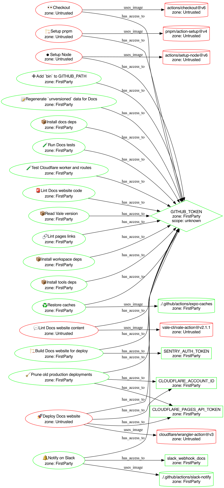
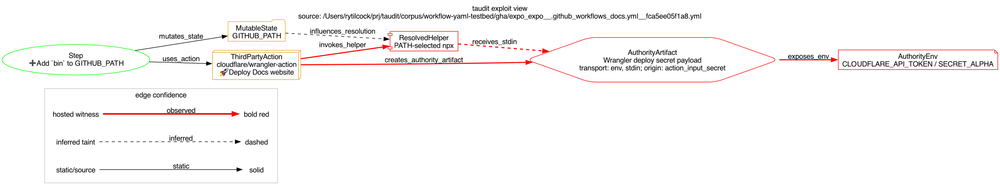

# Demo: Authority And Exploit Path In One Corpus Pipeline

This demo uses a compact corpus workflow:

`/Users/rytilcock/prj/taudit/corpus/workflow-yaml-testbed/gha/expo_expo__.github_workflows_docs.yml__fca5ee05f1a8.yml`

It is useful because one job shows both views taudit is meant to connect:

- Authority propagation: Cloudflare credentials are passed to a third-party deploy action, while implicit `GITHUB_TOKEN` authority is available at the action boundary through the GitHub Actions context.
- Exploit-candidate path: an earlier step mutates `GITHUB_PATH`; a later Cloudflare deploy action invokes package-manager and Wrangler helpers through PATH-sensitive command resolution while Cloudflare deploy authority is materialized in the action environment or supplied to helper processes.

## Reproduce

```bash
PIPE=/Users/rytilcock/prj/taudit/corpus/workflow-yaml-testbed/gha/expo_expo__.github_workflows_docs.yml__fca5ee05f1a8.yml

taudit scan --platform github-actions --format json "$PIPE" \
  | jq '{summary, key_findings: [.findings[] | select(.rule_id | IN(
      "authority_propagation",
      "self_mutating_pipeline",
      "gha_helper_path_sensitive_stdin",
      "gha_helper_path_sensitive_env",
      "gha_helper_untrusted_path_resolution",
      "later_secret_materialized_after_path_mutation"
    )) | {rule_id,severity,fingerprint,suppression_key,message}]}'

taudit graph --platform github-actions --format dot --view authority --rich-labels "$PIPE" \
  > docs/demos/assets/expo-docs-authority.dot

taudit graph --platform github-actions --format dot --view exploit "$PIPE" \
  > docs/demos/assets/expo-docs-exploit.dot

dot -Tpng docs/demos/assets/expo-docs-authority.dot \
  -o docs/demos/assets/expo-docs-authority.png

dot -Tpng docs/demos/assets/expo-docs-exploit.dot \
  -o docs/demos/assets/expo-docs-exploit.png
```

## What taudit Found

Observed scan summary:

- 30 findings: 3 critical, 10 high, 10 medium, 7 info.
- 5 authority roots.
- 10 untrusted sinks.
- 3 publication-adjacent sinks.
- Completeness is partial because two local composite actions are not resolved from disk in this corpus-only scan.

Key findings:

- `authority_propagation`: `CLOUDFLARE_ACCOUNT_ID` reaches `cloudflare/wrangler-action@v3`.
- `authority_propagation`: `CLOUDFLARE_PAGES_API_TOKEN` reaches `cloudflare/wrangler-action@v3`.
- `self_mutating_pipeline`: the `GITHUB_PATH` mutation step runs while `GITHUB_TOKEN` is in scope.
- `later_secret_materialized_after_path_mutation`: the PATH mutation happens before the Cloudflare action materializes deploy authority and invokes package-manager / Wrangler helpers through PATH-sensitive command resolution.
- `gha_helper_path_sensitive_stdin` and `gha_helper_path_sensitive_env`: the modeled helper executes with sensitive authority in its environment and, for secret-upload paths, may receive secret material through stdin.

The exact machine-readable summary is checked in at [expo-docs-taudit-summary.json](assets/expo-docs-taudit-summary.json).

## Authority View

The authority graph answers: “Where does authority go?”



In this view, the deploy action is a red external trust-boundary sink. The graph shows Cloudflare credentials passed to that sink and implicit `GITHUB_TOKEN` authority available at the same action boundary. This is not yet the exploit story; it is the authority inventory and trust-boundary map.

DOT source: [expo-docs-authority.dot](assets/expo-docs-authority.dot)

## Exploit-Candidate Path View

The exploit graph answers: “What is the shortest statically-observable path where earlier mutable runner state can influence a later credential-bearing execution boundary?”



The path is:

```text
Step: Add bin to GITHUB_PATH
  -> prepends PATH entry for subsequent job steps
  -> influences later PATH-based executable selection
  -> cloudflare/wrangler-action@v3 materializes Cloudflare authority
  -> action invokes package-manager / Wrangler helper through PATH-sensitive command resolution
  -> helper executes with CLOUDFLARE_* authority in environment
  -> secret-upload path may pass secret payload through stdin
```

The exploit relevance depends on one additional condition: the prepended PATH directory must be attacker-controlled, attacker-influenced, or untrusted-writable. Without that condition, this remains an authority-sensitive ordering pattern rather than an exploit candidate.

DOT source: [expo-docs-exploit.dot](assets/expo-docs-exploit.dot)

## Why This Is Bad

The issue is not that the workflow writes to `GITHUB_PATH`. GitHub Actions intentionally supports PATH mutation across later steps in the same job.

The issue is the timing and boundary:

1. An earlier step mutates runner-wide executable resolution state.
2. A later third-party action materializes Cloudflare deploy authority.
3. That action invokes package-manager / Wrangler helpers through PATH-sensitive resolution.
4. Those helper processes run with Cloudflare authority in their environment and may receive secret material through stdin.

That creates an authority-confusion review target. If the earlier PATH mutation can point at an attacker-controlled or untrusted-writable directory, then a later deploy credential may be handled by an executable selected through earlier mutable runner state.

This demo is a static corpus signal, not a vulnerability claim. A stronger claim needs action-source review plus a canary or hosted-runner witness demonstrating which executable is selected at runtime.

## How taudit Helps

taudit connected two facts that are usually reviewed separately:

- The authority graph shows the credential and token blast radius: Cloudflare deploy credentials are passed to the external action boundary, and implicit GitHub token authority is available there through the Actions context.
- The exploit-path graph compresses the execution-control fact into one review path: earlier mutable runner state can affect later helper resolution through PATH.
- The finding output carries both `fingerprint` for precise dedup and `suppression_key` for stable reviewed waivers.
- The summary identifies completeness gaps, so users know local composite actions were not resolved in this corpus scan.

The useful signal is the intersection: credential-bearing execution occurs after mutable PATH state has been introduced.

For remediation, start with one of these:

- Avoid PATH-resolved deploy helpers in credential-bearing actions.
- Resolve helpers by absolute trusted path or action-owned install path.
- Move PATH mutation after credential-bearing deploy actions when feasible.
- Scope job `permissions:` explicitly; avoid job-level deploy secrets, and pass deploy credentials only to the deploy action that needs them.
