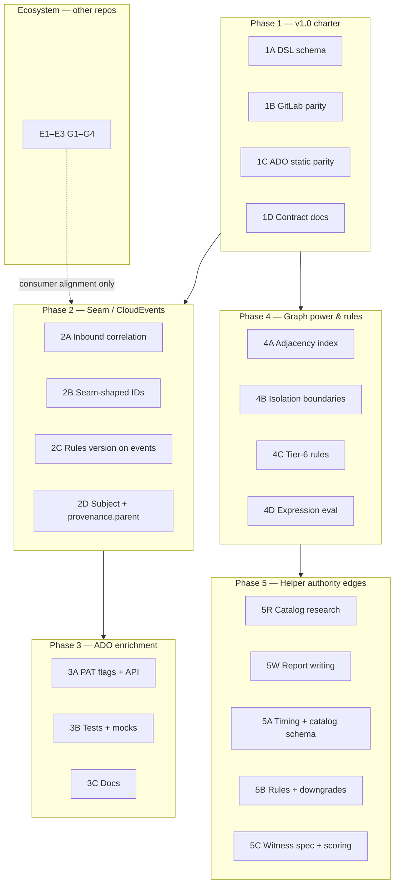

# Phased & laned jobs — multi-agent orchestration

**Purpose:** A single backlog engineers (and parallel background agents) can execute without duplicating work or thrashing the same files. **Phases** encode dependencies; **lanes** are parallel workstreams with explicit ownership.

**Related:**

| Doc | Role |
|-----|------|
| [`ROADMAP.md`](ROADMAP.md) | Horizons, v1.0 charter, AAA/Done gates |
| [`seam-freeze-v1.md`](seam-freeze-v1.md) | Cross-tool correlation / provenance vocabulary (draft until freeze criteria met) |
| [`../TODOS.md`](../TODOS.md) | ADO `--ado-pat` deep spec |
| [`adr/0003-strategic-spine-adoption-phased.md`](adr/0003-strategic-spine-adoption-phased.md) | Adoption spine |
| [`adr/0005-authority-edge-classifier-and-witness-handoff.md`](adr/0005-authority-edge-classifier-and-witness-handoff.md) | Helper-resolution authority-edge classifier and witness handoff |
| [`adr/0006-exploit-path-view-and-ruleset.md`](adr/0006-exploit-path-view-and-ruleset.md) | Exploit-path graph view and separate ruleset scope |
| [`research/BACKLOG-helper-resolution-authority-edges-adr0005.md`](research/BACKLOG-helper-resolution-authority-edges-adr0005.md) | ADR 0005 task backlog |
| [`research/PHASE1-lanes.md`](research/PHASE1-lanes.md) | **Different** scope — ADR 0002 `--rich-labels` / map Mermaid only |

**Verification defaults (repo root):** after substantive code changes, run `cargo fmt --all && cargo clippy --workspace --all-targets -- -D warnings && cargo test --workspace` and `just golden-paths` when CLI/output/docs paths changed.

---

## Max-parallel sprint (multiple background agents)

**Goal:** saturate throughput without merge fights. **1A (invariant JSON Schema)** is already shipped — do not duplicate that lane.

### Wave 1 — up to **5 agents** in parallel (minimal overlap)

| Agent | Lane | Owns (write) | Do **not** touch |
|-------|------|----------------|------------------|
| **G1** | **1B** GitLab parity | `crates/taudit-parse-gitlab/`, `tests/fixtures/` only if GitLab-scoped | `crates/taudit-parse-ado/`, `crates/taudit-sink-cloudevents/`, `crates/taudit-cli/src/main.rs` |
| **G2** | **1C** ADO static parity | `crates/taudit-parse-ado/`, ADO fixtures under `tests/fixtures/` | `crates/taudit-parse-gitlab/`, sink, `main.rs` unless unavoidable — coordinate |
| **G3** | **1D** Docs / contract copy | `docs/**/*.md`, `CHANGELOG.md`, `invariants/starter/README.md` | Any `crates/**/*.rs` |
| **G4** | **2A** Inbound correlation (env-only) | `crates/taudit-sink-cloudevents/src/lib.rs`, sink tests, `docs/seam-freeze-v1.md` status lines | `crates/taudit-parse-*`, `main.rs` — read `TAUDIT_CORRELATION_ID` in sink only for first slice |
| **G5** | **4C** or **4A** (pick **one**) | **4C:** one new invariant in `crates/taudit-core/src/rules.rs` + `docs/rules/*.md` + tests — only if you keep the diff **one rule + tests**. **4A:** adjacency/index work confined to `crates/taudit-core/src/graph.rs` + call sites — do **not** combine 4C+4A on one agent. | The other of 4C/4A; parser crates |

**Merge order (Wave 1):** land **G3** whenever; **G1** and **G2** can merge in any order; **G4** merges independently if it stays sink-only; **G5** may wait for rebase if it touches `taudit-core` types heavily — prefer **G1/G2** merge first if G5 edits graph APIs.

### Wave 2 — **1 agent** (serialized integration)

| Agent | Lane | Notes |
|-------|------|--------|
| **H1** | **2B–2D** seam-shaped CloudEvents | Single owner for `taudit-sink-cloudevents` + JSON shape docs; rebase after **G4** if correlation landed. **Expect `main.rs`** if new flags — no other agent edits `main.rs` this wave. |

### Wave 3 — **1–2 agents** after Wave 1 **G2** is quiet

| Agent | Lane | Notes |
|-------|------|--------|
| **I1** | **3A–3B** ADO `--ado-pat` | [`TODOS.md`](../TODOS.md); touches `parse-ado` + CLI — **do not run parallel with G2** on the same branch. |
| **I2** | **3C** Docs | `docs/verify.md`, `docs/baselines.md` after **I1** behaviour is stable. |

### Copy-paste prompts (one per agent)

**G1 — GitLab**

> You are **Agent G1**. Read [`docs/jobs-phased-lanes.md`](jobs-phased-lanes.md) Phase **1B** and [`docs/ROADMAP.md`](ROADMAP.md) Roadmap 3 (GitLab). Improve `crates/taudit-parse-gitlab/` toward `AuthorityCompleteness::Complete` with explicit gaps where impossible. **Write only** `taudit-parse-gitlab` and GitLab-scoped fixtures/tests. Run `cargo fmt`, `cargo clippy --workspace --all-targets -- -D warnings`, `cargo test --workspace`, and `just golden-paths` if behaviour/output docs change.

**G2 — ADO**

> You are **Agent G2**. Same as G1 but **Azure DevOps**: `crates/taudit-parse-ado/` and Roadmap / ADO gaps. Do not edit GitLab or sink crates in the same PR.

**G3 — Docs**

> You are **Agent G3**. Phase **1D**: align [`docs/authority-graph.md`](authority-graph.md), [`docs/golden-paths.md`](golden-paths.md), and [`CHANGELOG.md`](../CHANGELOG.md) with current behaviour; no Rust changes.

**G4 — Correlation (sink)**

> You are **Agent G4**. Phase **2A**: in `crates/taudit-sink-cloudevents`, if env var `TAUDIT_CORRELATION_ID` is set and non-empty, use it as `correlationid` for that emission; else keep `Uuid::new_v4()`. Never log the value. Add tests + a line in [`docs/seam-freeze-v1.md`](seam-freeze-v1.md) under taudit inventory. **No `main.rs`** in the first PR.

**G5 — Depth (pick one)**

> You are **Agent G5**. Choose **either** Tier-6 rule **4C** (one rule + docs + tests in `taudit-core`) **or** graph **4A** (adjacency/index in `graph.rs` + tests). One concern per PR. Run full workspace tests.

---

## Phase diagram

**Ordering rule:** Finish **Phase 1** lanes that touch parsers/schemas before treating **Phase 4** parser-heavy work as “stable underneath.” **Phase 2** can start once sink/schema ownership is agreed (avoid conflicting PRs on `taudit-sink-cloudevents`). **Phase 3** is optional enterprise noise reduction; does not block Phase 2.

---

## Phase 1 — Close the v1.0 charter

**Goal:** [`ROADMAP.md`](ROADMAP.md) “Near term” — **V1-2** (DSL schema governance), **V1-5** (three-platform parity at `Complete` where supported), **V1-6** (re-publishable contract docs).

| Lane | Job | Primary paths | Depends on | Done when |
|------|-----|---------------|------------|-----------|
| **1A** | **Publish / govern custom-rule DSL schema** | `contracts/schemas/authority-invariant-v1.schema.json`, `scripts/generate-authority-invariant-schema.py`, `scripts/validate-authority-invariant-yaml.py`, CI in `quality.yml` | — | **Shipped:** generator `--check` vs Rust `FindingCategory`; starter dir validated in CI. Iterate semver governance in docs as needed. |
| **1B** | **GitLab parser → `Complete`** (incremental) | `crates/taudit-parse-gitlab/`, tests | — | Roadmap R3 items landed or explicitly documented as Partial with typed gaps: `include:` resolution, protected-branch boundaries, variable scope. |
| **1C** | **ADO parser → `Complete`** (static YAML) | `crates/taudit-parse-ado/`, tests | — | **Increment shipped:** explicit `dependsOn` partial signaling landed. Continue closing remaining unsupported constructs with typed gaps; no silent under-modeling. |
| **1D** | **Contract & adoption docs** | `docs/authority-graph.md`, `docs/golden-paths.md`, `CHANGELOG.md`, ADRs as needed | 1A beneficial | Golden paths smoke clean; breaking vs additive schema changes called out in CHANGELOG. |

**Parallelism:** **1B** and **1C** are different crates — safe for two agents. **1A** touches schemas and loader — pair with **one** of 1B/1C if CI bandwidth is limited. **1D** can run as docs-only PRs in parallel if it does not restate unmerged schema filenames.

**Conflict hotspots:** `crates/taudit-cli/src/main.rs` (many lanes touch CLI); `contracts/schemas/` (coordinate with 1A).

---

## Phase 2 — Seam alignment & CloudEvents

**Goal:** Implement taudit-side gaps from [`seam-freeze-v1.md`](seam-freeze-v1.md) §152–201 without waiting on CellOS freeze — **additive**, backward compatible where possible.

| Lane | Job | Primary paths | Depends on | Done when |
|------|-----|---------------|------------|-----------|
| **2A** | **Inbound correlation ID** | `crates/taudit-sink-cloudevents/src/lib.rs`, CLI/env (`TAUDIT_CORRELATION_ID` or documented flag), tests | — | **Increment shipped:** sink honors non-empty `TAUDIT_CORRELATION_ID` env override for `correlationid`; fallback UUID behavior preserved and value is not logged. |
| **2B** | **Seam-shaped stable identifiers** | Sink + optional `taudit-core` helpers | 2A optional | **`pipelineId`** URN derived from existing pipeline content hash; documented mapping. Optional **`scanRunId`** per invocation documented (distinct from operator-flow correlation). |
| **2C** | **`rules_version` / reproducibility on events** | Sink, baseline metadata if needed | — | Each emitted finding event carries enough to answer “same rules as baseline?” without opening `.taudit/baselines/` (fields align with seam appendix intent). |
| **2D** | **`subject` URN + `provenance.parent` readiness** | Sink, CloudEvents schema docs under `contracts/` | 2A–2C coordinated | `subject` uses stable URN form where feasible (avoid absolute-path leakage); optional **`provenanceparent`** / nested provenance **additive** — schema + one fixture example. |

**Parallelism:** Prefer **one agent per crate** for 2A–2D, or **serialize** edits to `taudit-sink-cloudevents` with a lock file / branch naming convention (`feat/seam-2a-correlation` then rebase).

**Upstream freeze:** When CellOS publishes `seam-correlation-v1.schema.json`, add a doc PR **pointer** + validate emitted JSON against schema in CI (lane **2E** follow-up, optional).

---

## Phase 3 — ADO variable-group enrichment (enterprise)

**Goal:** Reduce `[partial]` noise for ADO variable groups per [`TODOS.md`](../TODOS.md).

| Lane | Job | Primary paths | Depends on | Done when |
|------|-----|---------------|------------|-----------|
| **3A** | **`--ado-org` / `--ado-project` / `--ado-pat`** + REST client | ADO parser context, `ureq`, `taudit-cli` | — | **Increment shipped:** opt-in flag/context wiring + variable-groups REST fetch + warning fallback path landed; PAT still never logged/persisted. |
| **3B** | **Tests & fixtures** | `tests/`, parser tests | 3A | Mock or recorded responses for secret vs plain vars; failure modes covered. |
| **3C** | **Documentation** | `docs/verify.md`, `docs/baselines.md`, optional `TODOS.md` status | 3A | Reproducibility caveat documented (live ADO state vs static YAML). |

**Parallelism:** **3B** trails **3A** slightly; **3C** last.

---

## Phase 4 — Graph power & deeper rules

**Goal:** Roadmap **Tier 6–8** and parser precision items not required for v1.0 charter closure — **parallelizable** once core graph schema is stable.

| Lane | Job | Primary paths | Depends on | Done when |
|------|-----|---------------|------------|-----------|
| **4A** | **Adjacency index** (large-repo perf) | `taudit-core` graph + hot consumers | — | Documented complexity improvement; criterion bench optional [`perf-baseline.md`](perf-baseline.md). |
| **4B** | **Isolation boundary modelling** | Core graph + rules | — | Explicit propagation breaks where runtime containment is modelled; tests. |
| **4C** | **Tier-6 rules** — `EgressBlindspot`, `MissingAuditTrail` | `taudit-core` rules, `docs/rules/` | — | Rules registered, documented, SARIF/explain wired. |
| **4D** | **Limited expression evaluation** (GHA) | GHA parser | — | Scoped milestone (e.g. known context keys only); conservative Partial fallback preserved. |

**Conflict hotspots:** **4D** touches the busiest parser — isolate long-running work behind a feature branch.

---

## Phase 5 — Helper-resolution authority edges

**Goal:** Implement [ADR 0005](adr/0005-authority-edge-classifier-and-witness-handoff.md) and [ADR 0006](adr/0006-exploit-path-view-and-ruleset.md): taudit classifies and ranks helper-resolution authority edges, emits a separate exploit-path graph/ruleset scope for candidate proof paths, emits internal witness specs where gated, and leaves proof execution to the witness harness.

Disclosure/CVE-oriented tooling is internal signal. Witness-spec emission, disclosure scores, CVE workflow metadata, private source anchors, and canary details must be feature-gated or internal-build-only and absent from default downstream/customer output.

| Lane | Job | Primary paths | Depends on | Done when |
|------|-----|---------------|------------|-----------|
| **5R** | **Research catalog anchors** | `docs/research/`, action catalog fixtures | - | Initial catalog entries have pinned versions/SHAs, helper invocation notes, authority transport, authority origin, witness status, and internal disclosure-score notes. |
| **5W** | **Report writing and caveats** | `docs/`, terminal/SARIF/report snapshots after code lands | 5R helpful | Customer-safe templates explain earlier mutable channel, later authority, helper sink, transport, same-job caveat, remediation, and no CVE/disclosure wording by default. |
| **5A** | **Timing + metadata schema** | `crates/taudit-core/src/graph.rs`, finding/report schemas, contracts | 5R input | Authority timing, helper resolution, transport, and origin are modeled without ad hoc strings. |
| **5B** | **Rules + downgrades** | `crates/taudit-core/src/rules.rs`, `docs/rules/`, sink mappings | 5A | `GHA_HELPER_PATH_LATER_AUTHORITY`, setup-node/setup-python/Docker-QEMU helper handoffs, installer-then-shell advisories, and transport-specific rules require ordered authority timing; absolute/toolcache/action-owned/explicit-mode cases downgrade or suppress. |
| **5C** | **Witness spec + scoring** | `crates/taudit-cli/`, report schemas, docs | 5A, 5B | `taudit witness-spec` and `disclosure_score` are feature-gated; default findings expose customer-safe authority classification, `technical_score`, confidence, witness status, and product labels. |
| **5D** | **Corpus authority mining** | `crates/taudit-core/src/rules.rs`, corpus fixtures, report labels | 5A | Shell authority concentration rules identify publish/deploy/sign/release hotspots as corpus signal or workflow hardening, not disclosure candidates by default. |
| **5E** | **Exploit-path ruleset scope** | `crates/taudit-core/src/exploit_path.rs`, rule/report schemas, `docs/authority-graph.md` | 5A, 5B | Exploit-path rules are candidate-agnostic deterministic patterns, tagged separately from authority rules; candidate packs are regression fixtures/evidence inputs, not one-off detections; `taudit graph --view exploit` keeps format parity with authority output; disclosure score, witness-spec, private anchors, and canary material are gated. |

**Researcher prompt:**

> You are the ADR 0005 researcher. Own `docs/research/` notes and catalog source anchors only. Build initial catalog evidence for Firebase, Azure, Cloudflare, Docker login, npm publish, ECR login, setup-gcloud, GoReleaser, Codecov, and Teleport. Return pinned versions/SHAs, helper invocation, helper resolution, authority transport, authority origin, witness status, and internal disclosure-score factors. Do not edit Rust.

**Writer prompt:**

> You are the ADR 0005 writer. Own report copy, examples, and docs only. Draft customer-safe text for helper-resolution authority findings that explains earlier mutable state, later authority materialization, helper sink, transport, same-job caveat, witness status, and remediation. Put witness next action, disclosure routing, and CVE language behind the internal feature gate only. Do not change rule logic.

**Conflict hotspots:** **5A/5B** touch `taudit-core` and finding schemas; keep one implementation owner at a time. **5C** may touch `crates/taudit-cli/src/main.rs`, so serialize it after the schema/rule shape is stable.

**Verification:** after code changes, run `cargo fmt --all`, `cargo clippy --workspace --all-targets -- -D warnings`, `cargo test --workspace`, cross-sink contract tests, and `just golden-paths` when CLI output or docs examples change.

---

## Ecosystem lanes (not implemented in this repo)

These satisfy [`seam-freeze-v1.md`](seam-freeze-v1.md) **G1–G4** and freeze criteria §5 — owned by **CellOS / tsafe / tencrypt / 0ryant-shell**.

| ID | Job | Owner |
|----|-----|--------|
| **E1** | Broker-emitted `correlationId` on secret issuance (G1) | tsafe + CellOS |
| **E2** | `provenance.parent` on tencrypt export receipts (G2) | tencrypt |
| **E3** | Publish `seam-correlation-v1.schema.json` + freeze record §6 | CellOS |
| **E4** | Subject URN routing in shell / tedit (G3) | 0ryant-shell |

**taudit role:** Emit/consume fields per Phase 2; document pointers after **E3** lands.

---

## Agent assignment (example)

| Agent | Phase | Lane | Notes |
|-------|-------|------|--------|
| A1 | 1 | 1B GitLab | Deep parser work |
| A2 | 1 | 1C ADO static | Deep parser work |
| A3 | 1 | 1A DSL schema | Schema + CI |
| A4 | 1 | 1D Docs | After filenames stable |
| A5 | 2 | 2A + 2B | Sink-heavy — **single writer** to `taudit-sink-cloudevents` |
| A6 | 3 | 3A–3C | ADO PAT feature |

Swap **A5** with two agents only after splitting branches (correlation-only PR first).

---

## Merge & conflict rules

1. **Single writer per high-churn file per sprint** — especially `crates/taudit-cli/src/main.rs` and `crates/taudit-sink-cloudevents/src/lib.rs`.
2. **Schemas first** — Lane **1A** merges before mass doc references to new schema URLs.
3. **Additive JSON fields** — Seam fields must not break existing CloudEvents consumers (optional attributes, documented defaults).
4. **End state:** `main` green with gates above; release notes / CHANGELOG updated for operator-visible flags or emission shape changes.

---

## Completion checklist (meta)

- [ ] Phase 1 exit: V1-2 / V1-5 / V1-6 satisfied per [`ROADMAP.md`](ROADMAP.md) near-term table.
- [ ] Phase 2 exit: Seam appendix in [`seam-freeze-v1.md`](seam-freeze-v1.md) updated with **implemented** vs **pending** for taudit rows.
- [ ] Phase 3 exit: [`TODOS.md`](../TODOS.md) status flipped or superseded by this doc.
- [ ] Phase 4 exit: Roadmap Tier 6/8 checkboxes advanced with linked PRs.

---

*Living document — bump footer date when phases complete.*

**Last updated:** 2026-04-30
